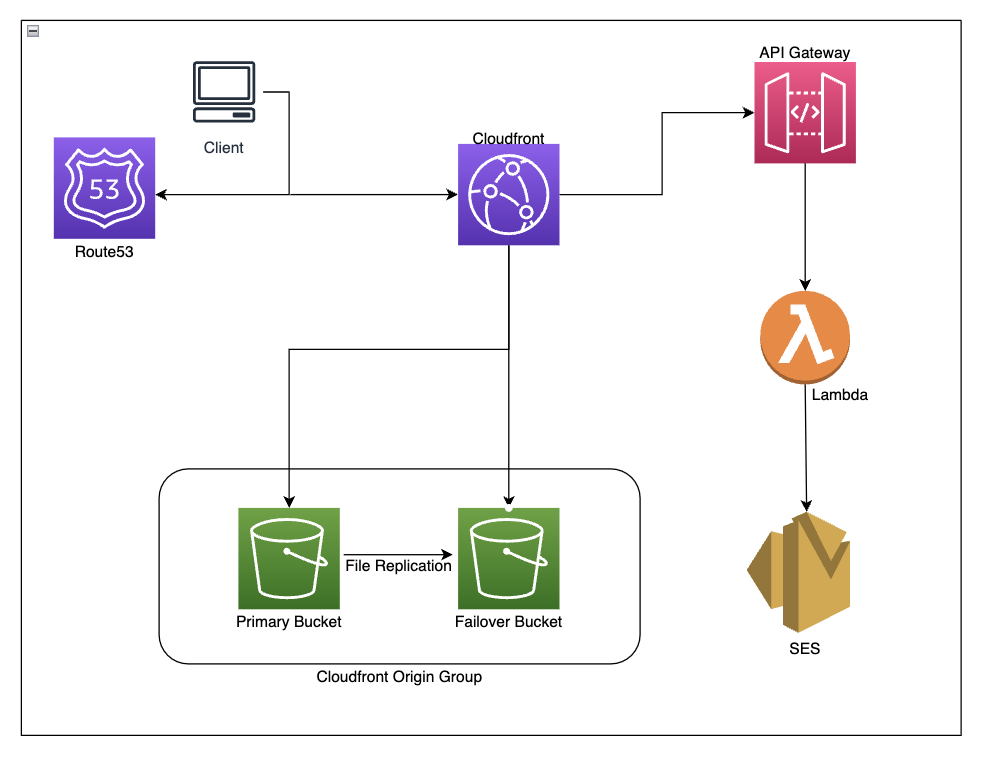

# Cullan's Portfolio Website

## About

[Cullancarey.com](https://cullancarey.com) is my personal portfolio website. It is a static AWS S3 website fronted by CloudFront. The site also features a contact form backed by a Lambda function, allowing visitors to connect with me.

## Automation

The automation for this repository's deployment utilizes AWS StackSets configured for my AWS organization. My [AWS Deployment Roles](https://github.com/cullancarey/aws_deployment_roles) repository contains CDK code that defines the CloudFormation StackSet, which deploys the deployment roles to the member accounts of my organization. I have created an OIDC GitHub Actions user in my management account. GitHub Actions assume this role first and then use it to assume the deployment roles in the member accounts. For more details, see [GitHub Actions Workflows](./.github/workflows).

## CDK Infrastructure

The website infrastructure is fully managed by AWS CDK. The CDK code is organized into constructs and stacks.

### Constructs

- [ACMCertificates](src/my_constructs/acm_certificate.py): Manages ACM certificates.
- [BackupWebsiteBucket](src/my_constructs/s3_bucket.py): Creates a backup S3 bucket.
- [ApiGwtoLambda](src/my_constructs/apigw_to_lambda.py): Sets up API Gateway and Lambda for the contact form.
- [CloudfrontDistribution](src/my_constructs/cloudfront_distribution.py): Manages CloudFront distributions.
- [S3Bucket](src/my_constructs/s3_bucket.py): Creates and configures S3 buckets.

For more details, see [Constructs](src/my_constructs/).

### Stacks

- [ACMCertificates](src/stacks/acm_certificates.py): ACM certificates stack.
- [BackupWebsiteBucket](src/stacks/backup_website_bucket.py): Backup website bucket stack.
- [Website](src/stacks/website.py): Main website stack.

For more details, see [Stacks](src/stacks/).

### Entry Point

- [app.py](src/app.py): The entry point for the CDK application.

## Architecture

